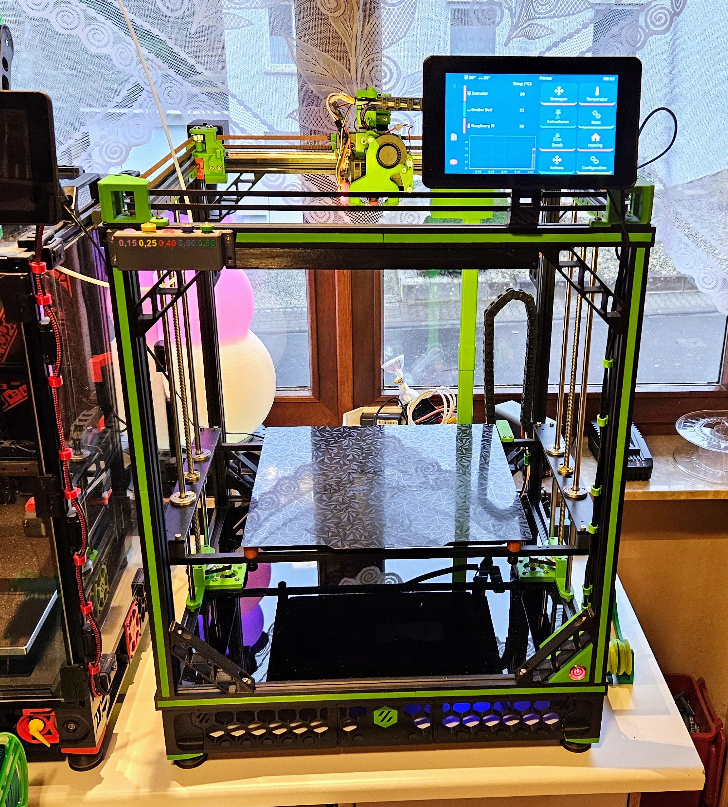
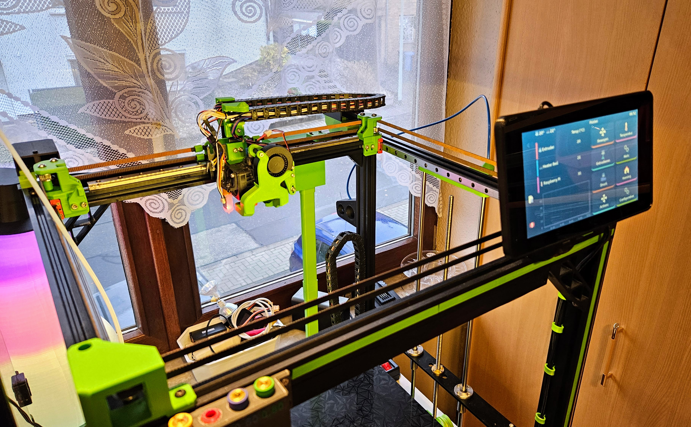
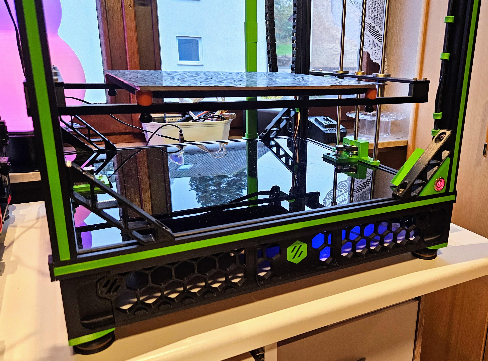
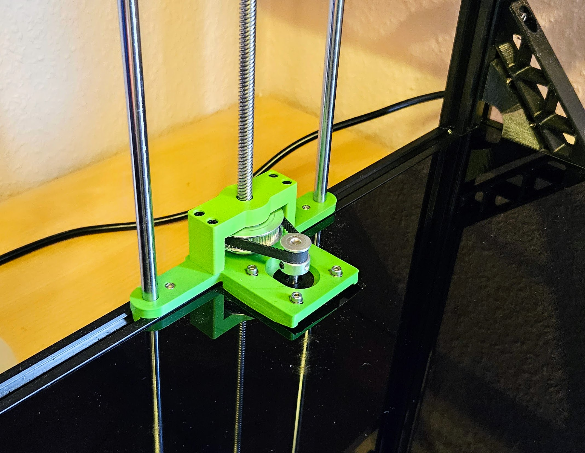

Die Konfig ist für einen Tronxy x5sa PRO mit einem SKR 1.3 Board.

Der Drucker wurde auf Linear Führungen umgebaut.

Druckbett 6mm feingefrästes Alu mit 750Watt/230Volt Heizmatte und Magnet FR4 oder PEI Druckplatte

Die Elektronik wurde (ähnlich wie bei bei meinem Voron2.4) unter den Drucker verfrachtet.

Druckkopf: E3D HEMERA Directdrive mit REVO - Schnellwechsel Düsen.

Mit z_tilt und Mesh-Leveling über BLTouch Sensor.

Falls ein anderes Board benutzt werden soll, müssen natürlich die Pin-Belegungen geändert werden.

## Umgebauter TronXY x5sa PRO

## Umbau auf MGN Rails

## Die Elektronik wurde unter dem Drucker (wie beim VORON) eingebaut. 

## Ich verwende bei dem Z-Antrieb ein Riemengetriebe (60Z - 20Z)
Hier der Link zu meinem Entwurf:
https://www.printables.com/de/model/528412-z-riemenantrieb-fur-tronxy-x5sa

Beim originalen Z-Antrieb muss "gear_ratio: 60:20" in der printer.cfg auskommentiert oder gelöscht werden.

